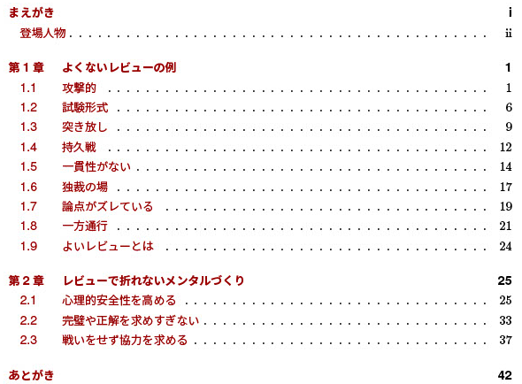

<!--
_class: top
_footer: "Copyright 2022 ACCESS CO., LTD. All rights reserved."
-->

# Google eng-practices とアイのムチの比較

---
<!--
_class: top
_footer: "Copyright 2022 ACCESS CO., LTD. All rights reserved."
-->

## 自己紹介

---
<!--
_class: normal
_header: "自己紹介"
_footer: "Copyright 2022 ACCESS CO., LTD. All rights reserved."
-->

* @tonionagauzzi
* Mobile App Engineer / SD Group
* https://about.me/knagauchi

---
<!--
_class: top
_footer: "Copyright 2022 ACCESS CO., LTD. All rights reserved."
-->
## はじめに
---
<!--
_class: normal
_header: "はじめに"
_footer: "Copyright 2022 ACCESS CO., LTD. All rights reserved."
-->
Google の Code Review Developer Guide

https://google.github.io/eng-practices/review/


> * [How To Do A Code Review](https://google.github.io/eng-practices/review/reviewer/): A detailed guide for code reviewers.
> * [The CL Author’s Guide](https://google.github.io/eng-practices/review/developer/): A detailed guide for developers whose CLs are going through review.

---
<!--
_class: normal
_header: "はじめに"
_footer: "Copyright 2022 ACCESS CO., LTD. All rights reserved."
-->

アイのムチ よくないレビューの例とレビューで折れないメンタルづくり（通称：レビュー本）




---
<!--
_class: normal
_header: "はじめに"
_footer: "Copyright 2022 ACCESS CO., LTD. All rights reserved."
-->

今日の発表内容

* Google ガイドの紹介
* レビュー本との比較

---
<!--
_class: top
_footer: "Copyright 2022 ACCESS CO., LTD. All rights reserved."
-->
## レビュアー編

---
<!--
_class: top
_footer: "Copyright 2022 ACCESS CO., LTD. All rights reserved."
-->
## [The Standard of Code Review](https://google.github.io/eng-practices/review/reviewer/standard.html)

---
<!--
_class: top
_footer: "Copyright 2022 ACCESS CO., LTD. All rights reserved."
-->
## 概要

---
<!--
_class: normal
_header: "概要"
_footer: "Copyright 2022 ACCESS CO., LTD. All rights reserved."
-->

レビュアーは CL（Change List。Pull Requestと読み替えてもよい） が完全でなくても、改善が前進する内容なら Approve をしてよい。

---
<!--
_class: normal
_header: "概要"
_footer: "Copyright 2022 ACCESS CO., LTD. All rights reserved."
-->
「完璧なコード」は存在せず、「より良いコード」しかない。
すべての小さな部分を直すべきではなく、重要な修正と継続的な改善のバランスを取る。
ただし、明らかに悪化するものは拒否してよい。

---
<!--
_class: top
_footer: "Copyright 2022 ACCESS CO., LTD. All rights reserved."
-->
## Mentoring

---
<!--
_class: normal
_header: "Mentoring"
_footer: "Copyright 2022 ACCESS CO., LTD. All rights reserved."
-->
レビューはレビュイーに何かを教える機会でもある。知識の共有は改善プロセスの一部。
その場で重要でないコメントは`Nit：`のような接頭辞を付ける。

---
<!--
_class: top
_footer: "Copyright 2022 ACCESS CO., LTD. All rights reserved."
-->
## Principles （原則）

---
<!--
_class: normal
_header: "Principles （原則）"
_footer: "Copyright 2022 ACCESS CO., LTD. All rights reserved."
-->
スタイルガイドのような原則には必ず従い、そこにないものはある程度レビュイーの意向を受け入れるか、既存のコードに合わせるよう依頼する。

---
<!--
_class: top
_footer: "Copyright 2022 ACCESS CO., LTD. All rights reserved."
-->
## Resolving Conflicts （競合解決）

---
<!--
_class: normal
_header: "Resolving Conflicts （競合解決）"
_footer: "Copyright 2022 ACCESS CO., LTD. All rights reserved."
-->
意見が分かれた場合、このガイドの内容に基づいて決めるか、コメントのやり取りではなくミーティングを開催して、議論した結果を CL に記録する。
解決しなければ、第三者に入ってもらう。

---
<!--
_class: top
_footer: "Copyright 2022 ACCESS CO., LTD. All rights reserved."
-->
## アイのムチのThe Standard of Code Review

---
<!--
_class: normal
_header: "アイのムチのThe Standard of Code Review"
_footer: "Copyright 2022 ACCESS CO., LTD. All rights reserved."
-->
「1.9 よいレビューとは」に書いてる方向性は同じですが、スタイルガイドのような原則が必要であることの言及は抜けていました。

---
<!--
_class: top
_footer: "Copyright 2022 ACCESS CO., LTD. All rights reserved."
-->
## [What to look for in a code review](https://google.github.io/eng-practices/review/reviewer/looking-for.html)

---
<!--
_class: top
_footer: "Copyright 2022 ACCESS CO., LTD. All rights reserved."
-->
## 概要

---
<!--
_class: normal
_header: "概要"
_footer: "Copyright 2022 ACCESS CO., LTD. All rights reserved."
-->

コードレビューは次のことを確認する。

* コードがよく設計されていること
* 機能がユーザーと将来の開発者の両方にとって優れていること
* UIの変更が賢く見栄えがよいこと
* 並列プログラミングが安全に行われること
* コードが必要以上に複雑でないこと

---
<!--
_class: normal
_header: "概要"
_footer: "Copyright 2022 ACCESS CO., LTD. All rights reserved."
-->
* 将来必要になるが今必要かどうかわからないものまで実装していないか
* 適切な単体テストがあるか
* テストがよく設計されているか
* 何であれ明確な名前が使われているか
* コメントが明確で有用、コードの説明ではなく必要な理由を説明していること

---
<!--
_class: normal
_header: "概要"
_footer: "Copyright 2022 ACCESS CO., LTD. All rights reserved."
-->
* ドキュメント化されていること
* スタイルガイドに準拠していること

---
<!--
_class: normal
_header: "概要"
_footer: "Copyright 2022 ACCESS CO., LTD. All rights reserved."
-->
レビューを依頼されたコードのすべての行を確認し、環境を確認し、コードの状態が改善されていることを確認し、レビュイーが行っている優れた点を称賛する。

---
<!--
_class: top
_footer: "Copyright 2022 ACCESS CO., LTD. All rights reserved."
-->
## Design （設計）

---
<!--
_class: normal
_header: "Design （設計）"
_footer: "Copyright 2022 ACCESS CO., LTD. All rights reserved."
-->
レビューで見る最重要点は、変更はすべて意味があるか、ベースコードとライブラリのどちらに属するか、うまく結合されているか、今すべき変更か、といった CL の全体設計。

---
<!--
_class: top
_footer: "Copyright 2022 ACCESS CO., LTD. All rights reserved."
-->
## Functionality （機能性）

---
<!--
_class: normal
_header: "Functionality （機能性）"
_footer: "Copyright 2022 ACCESS CO., LTD. All rights reserved."
-->
開発者が意図したとおり動くこと、ユーザーや将来の開発者のために良いこと、バグがないこと、並列プログラミングがあるならデッドロックや競合みたいなリスクがないかを見る。

---
<!--
_class: top
_footer: "Copyright 2022 ACCESS CO., LTD. All rights reserved."
-->
## Complexity （複雑さ）

---
<!--
_class: normal
_header: "Complexity （複雑さ）"
_footer: "Copyright 2022 ACCESS CO., LTD. All rights reserved."
-->
レビュアーが CL をすぐに理解できなかったり機能の検証が難しい場合、おそらく複雑なコードになっている。
過剰な設計が入っていないか、今解決すべき問題にだけ取り組んでいるかを見る。

---
<!--
_class: top
_footer: "Copyright 2022 ACCESS CO., LTD. All rights reserved."
-->
## Tests

---
<!--
_class: normal
_header: "Tests"
_footer: "Copyright 2022 ACCESS CO., LTD. All rights reserved."
-->
テストが CL に含まれており、正しく有用であることを見る。
テストはレビュー対象外としない。

---
<!--
_class: top
_footer: "Copyright 2022 ACCESS CO., LTD. All rights reserved."
-->
## Naming

---
<!--
_class: normal
_header: "Naming"
_footer: "Copyright 2022 ACCESS CO., LTD. All rights reserved."
-->
読みづらい長さでなく、何であるかを示す、または、何をするかを完全に伝えるような良い命名をしているかを見る。

---
<!--
_class: top
_footer: "Copyright 2022 ACCESS CO., LTD. All rights reserved."
-->
## Comments

---
<!--
_class: normal
_header: "Comments"
_footer: "Copyright 2022 ACCESS CO., LTD. All rights reserved."
-->
わかりやすく明確なコメントが書かれてるかを見る。
コメントはそのコードが必要な理由を説明するためのもので、コード自体の説明に書くならコード自体をわかりやすくすること。

---
<!--
_class: top
_footer: "Copyright 2022 ACCESS CO., LTD. All rights reserved."
-->
## Style

---
<!--
_class: normal
_header: "Style"
_footer: "Copyright 2022 ACCESS CO., LTD. All rights reserved."
-->
スタイルガイドに従っているかを見る。
スタイルガイドにないが改善したいことは`Nit:`をつけて対応必須ではないコメントとする。

また、他の変更を同じ CL に入れない。
例えば機能変更中に再フォーマットしたい場合、機能変更と再フォーマットを別々の CL とする。

---
<!--
_class: top
_footer: "Copyright 2022 ACCESS CO., LTD. All rights reserved."
-->
## Consistency （一貫性）

---
<!--
_class: normal
_header: "Consistency （一貫性）"
_footer: "Copyright 2022 ACCESS CO., LTD. All rights reserved."
-->
スタイルガイドになく新しいルールでもないものは、既存のコードとの一貫性を維持しているかを見る。

---
<!--
_class: top
_footer: "Copyright 2022 ACCESS CO., LTD. All rights reserved."
-->
## Documentation

---
<!--
_class: normal
_header: "Documentation"
_footer: "Copyright 2022 ACCESS CO., LTD. All rights reserved."
-->
ビルドやテスト、リリースに関するものを追加/更新/削除したら、READMEなどドキュメントも追加/更新/削除しているかを見る。

---
<!--
_class: top
_footer: "Copyright 2022 ACCESS CO., LTD. All rights reserved."
-->
## Every Line （すべての行）

---
<!--
_class: normal
_header: "Every Line （すべての行）"
_footer: "Copyright 2022 ACCESS CO., LTD. All rights reserved."
-->
一部のコードを注意深く精査しつつ、全てのコードを理解して見る。
理解が難しい場合、他のレビュアーも理解が難しい可能性があるので、レビュイーにコードの明確化をお願いする。
理解はできるが自分では承認判断できない場合、判断できるレビュアーを見つける。

---
<!--
_class: top
_footer: "Copyright 2022 ACCESS CO., LTD. All rights reserved."
-->
## Exceptions （例外）

---
<!--
_class: normal
_header: "Exceptions （例外）"
_footer: "Copyright 2022 ACCESS CO., LTD. All rights reserved."
-->
複数のレビュアーがおり、自分が一部だけ見る場合、レビューした部分や他の人への期待をコメントで伝える。

---
<!--
_class: top
_footer: "Copyright 2022 ACCESS CO., LTD. All rights reserved."
-->
## Context （環境）

---
<!--
_class: normal
_header: "Context （環境）"
_footer: "Copyright 2022 ACCESS CO., LTD. All rights reserved."
-->
レビューツールの非表示部分（ファイル全体）も含めて確認し、変更が意味をなしているか、小さなメソッドに分割する必要はないか、これを入れることでシステムがより複雑にならないかを見る。

---
<!--
_class: top
_footer: "Copyright 2022 ACCESS CO., LTD. All rights reserved."
-->
## Good Things

---
<!--
_class: normal
_header: "Good Things"
_footer: "Copyright 2022 ACCESS CO., LTD. All rights reserved."
-->
CL でよかったこと、素晴らしいことはレビュイーに伝える。
メンタリングの観点で、間違いだけに焦点を当てず、励ましや感謝も伝える。

---
<!--
_class: top
_footer: "Copyright 2022 ACCESS CO., LTD. All rights reserved."
-->
## アイのムチのWhat to look for in a code review

---
<!--
_class: normal
_header: "アイのムチのWhat to look for in a code review"
_footer: "Copyright 2022 ACCESS CO., LTD. All rights reserved."
-->
Google ガイドほど詳細なレビュー基準は書きませんでしたが、「1.5 一貫性がない」は Style や Consistency の章に通ずる内容だったり、「1.1 攻撃的」のアメさんのコメントは、間違いだけでなく合っている箇所を認めて励ます Good Things と同じ意図が含まれています。

---
<!--
_class: normal
_header: "アイのムチのWhat to look for in a code review"
_footer: "Copyright 2022 ACCESS CO., LTD. All rights reserved."
-->
また、「1.4 持久戦」は解釈を変えると Google ガイドの本章全体のように合理的に本質的な問題に注力すれば、レビューが長引いたり疲れたりしにくくなるということです。

---
<!--
_class: normal
_header: "アイのムチのWhat to look for in a code review"
_footer: "Copyright 2022 ACCESS CO., LTD. All rights reserved."
-->
正直、もし本を書く前にこの章を読んでいたら、取り入れたいエッセンスがいくつもありました。筆者としては同意見というか、新しい気づきもいくつもありました。

---
<!--
_class: top
_footer: "Copyright 2022 ACCESS CO., LTD. All rights reserved."
-->
## [Navigating a CL in review](https://google.github.io/eng-practices/review/reviewer/navigate.html)

---
<!--
_class: top
_footer: "Copyright 2022 ACCESS CO., LTD. All rights reserved."
-->
## 概要

---
<!--
_class: normal
_header: "概要"
_footer: "Copyright 2022 ACCESS CO., LTD. All rights reserved."
-->
複数のファイルにまたがるような大きなレビューで最も効率的な方法は、よい説明が書かれていること。
最重要部分に注目し、全体的にうまく設計されているか見てから、 CL の残りの部分を順序立てて見る。

---
<!--
_class: top
_footer: "Copyright 2022 ACCESS CO., LTD. All rights reserved."
-->
## Step One: Take a broad view of the change （広く見る）

---
<!--
_class: normal
_header: "Step One: Take a broad view of the change （広く見る）"
_footer: "Copyright 2022 ACCESS CO., LTD. All rights reserved."
-->
Rejectしたい CL なら、その理由をすぐにコメントする。拒否だけでなく、代わりに何をすべきか提案する。
例えば「グッジョブです、ありがとう！でも、実はFooWidgetは廃止予定なので、かわりに新しいBarWidgetを変更しましょう」

---
<!--
_class: normal
_header: "Step One: Take a broad view of the change （広く見る）"
_footer: "Copyright 2022 ACCESS CO., LTD. All rights reserved."
-->
丁寧な言葉づかいで礼儀を示すのは大事。意見が合わない場合でも、開発者同士お互いを尊重する。
不要な変更が複数作られるような状況なら、何かがまずいので、コミュニケーションやレビュープロセス改善で未然に防ぐことも重要。

---
<!--
_class: top
_footer: "Copyright 2022 ACCESS CO., LTD. All rights reserved."
-->

## Step Two: Examine the main parts of the CL （主要部分を見る）

---
<!--
_class: normal
_header: "Step Two: Examine the main parts of the CL （主要部分を見る）"
_footer: "Copyright 2022 ACCESS CO., LTD. All rights reserved."
-->
論理的な変更の数がいちばん多いファイルがおそらく主要な部分なので、最初にそこを見るのが効率的。
どこから見ればいいかわからなければ、レビュイーに聞くか、複数の CL に分割する提案をする。

---
<!--
_class: normal
_header: "Step Two: Examine the main parts of the CL （主要部分を見る）"
_footer: "Copyright 2022 ACCESS CO., LTD. All rights reserved."
-->
主要部分を見て設計の問題に気づいたら、レビュー途中でもコメントを送信したほうがよい。主幹設計が変更されると、残りの部分のレビューは無駄になるかもしれないし、レビュイーがレビューの合間に進めている次の CL も手戻りになるかもしれない。
主幹設計の変更には時間がかかり、大抵期限があるので、できるだけ早く着手したほうがよい。

---
<!--
_class: top
_footer: "Copyright 2022 ACCESS CO., LTD. All rights reserved."
-->
## Step Three: Look through the rest of the CL in an appropriate sequence （残りを順序立てて見る）

---
<!--
_class: normal
_header: "Step Three: Look through the rest of the CL in an appropriate sequence （残りを順序立てて見る）"
_footer: "Copyright 2022 ACCESS CO., LTD. All rights reserved."
-->
設計の問題がなければ、呼び出し関係など論理的な順序を理解して残りを見る。
最初にテストを読むと変更で何が起きるのかがわかりやすい。

---
<!--
_class: top
_footer: "Copyright 2022 ACCESS CO., LTD. All rights reserved."
-->
## アイのムチのNavigating a CL in review

---
<!--
_class: normal
_header: "アイのムチのNavigating a CL in review"
_footer: "Copyright 2022 ACCESS CO., LTD. All rights reserved."
-->
「1.3 突き放し」にて、よいレビューの例としてアメさんがコメントしていますが、これがまさに Google ガイドの Step One で述べられた内容と同じで、礼儀を伴いながら設計レベルでの変更を提案しています。

---
<!--
_class: normal
_header: "アイのムチのNavigating a CL in review"
_footer: "Copyright 2022 ACCESS CO., LTD. All rights reserved."
-->
レビュー途中でコメントを送信すること、設計に問題がなければ順序立てて残りを見ることまでは言及していませんが、筆者としては、これらも同意見です。

---
<!--
_class: top
_footer: "Copyright 2022 ACCESS CO., LTD. All rights reserved."
-->
## [Speed of Code Reviews](https://google.github.io/eng-practices/review/reviewer/speed.html)

---
<!--
_class: top
_footer: "Copyright 2022 ACCESS CO., LTD. All rights reserved."
-->
## Why Should Code Reviews Be Fast?

---
<!--
_class: normal
_header: "Why Should Code Reviews Be Fast?"
_footer: "Copyright 2022 ACCESS CO., LTD. All rights reserved."
-->
コードレビューが遅いと、スケジュールは遅れ、苛立ちがレビュアーに向かったり、よいコーディングを妥協する傾向がある。
レビューが早いと苛立ちは少なくなり、よいコーディングや改善の余裕も生まれるので、プロセスの高速化でレビューを早くしよう。

---
<!--
_class: top
_footer: "Copyright 2022 ACCESS CO., LTD. All rights reserved."
-->
## How Fast Should Code Reviews Be?

---
<!--
_class: normal
_header: "How Fast Should Code Reviews Be?"
_footer: "Copyright 2022 ACCESS CO., LTD. All rights reserved."
-->
通常であれば、レビューを依頼された直後に見るのがいちばんよい。遅くても1営業日。つまりレビュー依頼から1日以内に最低1回〜複数回のレビューが行われる。

---
<!--
_class: top
_footer: "Copyright 2022 ACCESS CO., LTD. All rights reserved."
-->
## Speed vs. Interruption

---
<!--
_class: normal
_header: "Speed vs. Interruption"
_footer: "Copyright 2022 ACCESS CO., LTD. All rights reserved."
-->
とはいえコーディングなどの集中作業を中断してレビュー対応すると、スムーズな作業に戻るには時間がかかるという調査結果がある。レビューを待ってもらったほうがコストが少ない場合もある。

---
<!--
_class: normal
_header: "Speed vs. Interruption"
_footer: "Copyright 2022 ACCESS CO., LTD. All rights reserved."
-->
集中作業の中断地点でレビューするとバランスがよい。例えば、ひと段落したとき、昼食後、会議から戻ったとき、休憩から戻ったとき。

---
<!--
_class: top
_footer: "Copyright 2022 ACCESS CO., LTD. All rights reserved."
-->
## Fast Responses

---
<!--
_class: normal
_header: "Fast Responses"
_footer: "Copyright 2022 ACCESS CO., LTD. All rights reserved."
-->
全体を見ていなくても、途中まででコメントを送ったり、いつ見れるかを事前に知らせたりすると、レビュイーがレビューが遅いと感じる苛立ちが大幅に緩和される。

---
<!--
_class: normal
_header: "Fast Responses"
_footer: "Copyright 2022 ACCESS CO., LTD. All rights reserved."
-->
個々の応答は高速でも、レビュー自体には十分に時間をかけて「LGTM」が「このコードが当社の基準を満たしている」を意味するレビューを行う。

---
<!--
_class: top
_footer: "Copyright 2022 ACCESS CO., LTD. All rights reserved."
-->
## Cross-Time-Zone Reviews

---
<!--
_class: normal
_header: "Cross-Time-Zone Reviews"
_footer: "Copyright 2022 ACCESS CO., LTD. All rights reserved."
-->
タイムゾーンが異なり、返信が必要なコメントをする場合、実装者が仕事を終える前、さらに応答する余裕がある時間帯にコメントする。
実装者が仕事を終えている場合、翌日仕事を始める前にできる限りのレビューを終える。

---
<!--
_class: top
_footer: "Copyright 2022 ACCESS CO., LTD. All rights reserved."
-->
## LGTM With Comments

---
<!--
_class: normal
_header: "LGTM With Comments"
_footer: "Copyright 2022 ACCESS CO., LTD. All rights reserved."
-->
CL に未解決のことがあっても、レビュアーが LGTM したほうがよい場合がある。
レビュイーが残りのコメントすべてにちゃんと対応してくれると確信できる場合や、残りの変更が軽微な場合、先にLGTMしておくと、LGTMを待つためだけに1日遅れるようなことを防げる。

---
<!--
_class: top
_footer: "Copyright 2022 ACCESS CO., LTD. All rights reserved."
-->
## Large CLs

---
<!--
_class: normal
_header: "Large CLs"
_footer: "Copyright 2022 ACCESS CO., LTD. All rights reserved."
-->
CL が非常に大きい場合、CL の分割を依頼する。レビュイーにとっては面倒でも、レビュアーにとってはとても助かる。
分割できない場合、全体的な設計を見て生じたコメントはすぐ送信する。

---
<!--
_class: normal
_header: "Large CLs"
_footer: "Copyright 2022 ACCESS CO., LTD. All rights reserved."
-->
レビュイーのブロッキングを無くしたり、レビュイーが迅速に対応できることがレビュアーの目標の1つである。

---
<!--
_class: top
_footer: "Copyright 2022 ACCESS CO., LTD. All rights reserved."
-->
## Code Review Improvements Over Time

---
<!--
_class: normal
_header: "Code Review Improvements Over Time"
_footer: "Copyright 2022 ACCESS CO., LTD. All rights reserved."
-->
これらのガイドに従って厳格にレビューしていれば、やがてレビュープロセスがどんどん速くなる傾向がある。
レビュイーはよいコーディングを学び、最初から優れた CL を送る。これにより、レビュー時間がますます少なくなる。

---
<!--
_class: normal
_header: "Code Review Improvements Over Time"
_footer: "Copyright 2022 ACCESS CO., LTD. All rights reserved."
-->
一方のレビュアーは、迅速なレビューを学ぶ。ただし、早さのためにレビュー基準や品質を妥協しないこと。

---
<!--
_class: top
_footer: "Copyright 2022 ACCESS CO., LTD. All rights reserved."
-->
## Emergencies

---
<!--
_class: normal
_header: "Emergencies"
_footer: "Copyright 2022 ACCESS CO., LTD. All rights reserved."
-->
とはいえ CL が迅速にレビューされ、品質が妥協されるような緊急事態もある。本番環境のユーザーに影響するバグ、いわゆるシステム障害である。

---
<!--
_class: top
_footer: "Copyright 2022 ACCESS CO., LTD. All rights reserved."
-->
## アイのムチのSpeed of Code Reviews

---
<!--
_class: normal
_header: "アイのムチのSpeed of Code Reviews"
_footer: "Copyright 2022 ACCESS CO., LTD. All rights reserved."
-->
レビューの速度を上げるという観点では、「1.7 論点がズレている」に書いたよくないレビューパターンへの言及くらいだと思います。

---
<!--
_class: normal
_header: "アイのムチのSpeed of Code Reviews"
_footer: "Copyright 2022 ACCESS CO., LTD. All rights reserved."
-->
また、「1.8 一方通行」で、システム障害が発生して高速なレビューをおこなっているシーンが出てきますが、これはベテランのコードがノーレビューで適用されていたり、議論を避けたりといった、Google ガイドに書かれている「厳格にレビューしているか、妥協するか」の2択以前の話でした。

---
<!--
_class: normal
_header: "アイのムチのSpeed of Code Reviews"
_footer: "Copyright 2022 ACCESS CO., LTD. All rights reserved."
-->
でも起こりうる話なので、いきなり高品質かつ高速なレビューを心がけるのではなく、まず今やれる範囲でレビューする、それを繰り返して徐々に改善していく、という受容と向上心みたいなものが大事だと思っています。Code Review Improvements Over Time と方向性は一緒ですね。

---
<!--
_class: top
_footer: "Copyright 2022 ACCESS CO., LTD. All rights reserved."
-->
## [How to write code review comments](https://google.github.io/eng-practices/review/reviewer/comments.html)

---
<!--
_class: top
_footer: "Copyright 2022 ACCESS CO., LTD. All rights reserved."
-->
## 概要

---
<!--
_class: normal
_header: "概要"
_footer: "Copyright 2022 ACCESS CO., LTD. All rights reserved."
-->
* 親切に
* あなたの考えを説明する
* 明確な指示だけでなく、レビュイーに決定させることでバランスを取る
* 複雑さを説明するだけでなく、単純化やコメント追加をレビュイーに促す

---
<!--
_class: top
_footer: "Copyright 2022 ACCESS CO., LTD. All rights reserved."
-->
## Courtesy （礼儀）

---
<!--
_class: normal
_header: "Courtesy （礼儀）"
_footer: "Copyright 2022 ACCESS CO., LTD. All rights reserved."
-->
コードに対してコメントし、開発者に対してコメントしない。無駄な動揺や論争は避ける。

* 悪い例：「並行性から得られるメリットが明らかでないのに、なぜここでスレッドを使用したのですか？」

---
<!--
_class: normal
_header: "Courtesy （礼儀）"
_footer: "Copyright 2022 ACCESS CO., LTD. All rights reserved."
-->
* 良い例：「ここでの同時実行は、私が見たところ実パフォーマンスにメリットがなく、システムに複雑さを追加しています。パフォーマンスメリットがないので、このコードはシングルスレッドにするのが最適だと思います」

---
<!--
_class: top
_footer: "Copyright 2022 ACCESS CO., LTD. All rights reserved."
-->
## Explain Why

---
<!--
_class: normal
_header: "Explain Why"
_footer: "Copyright 2022 ACCESS CO., LTD. All rights reserved."
-->
コメントした意図、考えたベストプラクティス、もしくは提案によってコードの状態がどのように改善されるかをちゃんと伝えると役立つことがある。

---
<!--
_class: top
_footer: "Copyright 2022 ACCESS CO., LTD. All rights reserved."
-->
## Giving Guidance

---
<!--
_class: normal
_header: "Giving Guidance"
_footer: "Copyright 2022 ACCESS CO., LTD. All rights reserved."
-->
直接指示ではなく、問題を指摘して開発者に決定を任せることで、開発者の学習や、開発者＝コードの専門家からのより良いソリューションに繋がることがある。

---
<!--
_class: normal
_header: "Giving Guidance"
_footer: "Copyright 2022 ACCESS CO., LTD. All rights reserved."
-->
ただし、直接的な指示、提案、コードの提示でも役立つことはある。コードレビューの主な目標は、可能な限り最高の CL を得ること、そして2番目が成長やレビューの削減に繋がること。

---
<!--
_class: normal
_header: "Giving Guidance"
_footer: "Copyright 2022 ACCESS CO., LTD. All rights reserved."
-->
CL で気に入ったものを見つけたら、それらにもコメントする。レビュイーはリファクタリングやテストカバレッジの追加を、レビュアーは CL から何かをいつも学ぶ。いいね！を伝えて、レビュイーが良い実装を続けることを後押しする。

---
<!--
_class: top
_footer: "Copyright 2022 ACCESS CO., LTD. All rights reserved."
-->
## Accepting Explanations

---
<!--
_class: normal
_header: "Accepting Explanations"
_footer: "Copyright 2022 ACCESS CO., LTD. All rights reserved."
-->
理解できないコードの説明をレビュイーに依頼する際、レビュイーがコードをより明確に書き直すか、過度に複雑でなければコードにコメントを追加するように促せるとよい。

---
<!--
_class: normal
_header: "Accepting Explanations"
_footer: "Copyright 2022 ACCESS CO., LTD. All rights reserved."
-->
CL 上に説明を書くことは、将来のコード読者のためにはならないし大抵読まれない。しかし、自分自身があまり知らないながらレビューしていたり、すでに知ってるはずのことをあらためて説明するときなど、いくつかの状況では役立つ。

---
<!--
_class: top
_footer: "Copyright 2022 ACCESS CO., LTD. All rights reserved."
-->
## アイのムチのHow to write code review comments

---
<!--
_class: normal
_header: "アイのムチのHow to write code review comments"
_footer: "Copyright 2022 ACCESS CO., LTD. All rights reserved."
-->
「1.3 突き放し」の一文に、Giving Guidance と同じ趣旨を書いています。また、「1.9 よいレビューとは」に、Accepting Explanations 以外については同じようなことを書きました。

今いるメンバーのメンタル面の作用に着目しているので、将来の開発者に役立つレビューを行うという観点はあまりありませんでした。

---
<!--
_class: top
_footer: "Copyright 2022 ACCESS CO., LTD. All rights reserved."
-->

## [Handling pushback in code reviews](https://google.github.io/eng-practices/review/reviewer/pushback.html)

---
<!--
_class: top
_footer: "Copyright 2022 ACCESS CO., LTD. All rights reserved."
-->

## 概要

---
<!--
_class: normal
_header: "概要"
_footer: "Copyright 2022 ACCESS CO., LTD. All rights reserved."
-->
時々、レビュイーは反論したり、レビュアーの提案に同意しなかったり、厳しすぎると不平を言う。

---
<!--
_class: top
_footer: "Copyright 2022 ACCESS CO., LTD. All rights reserved."
-->
## Who is right?

---
<!--
_class: normal
_header: "Who is right?"
_footer: "Copyright 2022 ACCESS CO., LTD. All rights reserved."
-->
何が正しいかを検討する。レビュイーはレビュアーよりもコードに近いので、具体的な洞察を持っているかもしれない。レビュイーの正しさは認める。

---
<!--
_class: normal
_header: "Who is right?"
_footer: "Copyright 2022 ACCESS CO., LTD. All rights reserved."
-->
レビュアーが正しいと考える場合、返信への理解を示しながら、提案が正しい理由、追加情報を示すのが適切。
受け入れられるまで数回やりとりが発生したとしても、常に礼儀正しく、相手への理解を示す。同意し​​ないだけ。

---
<!--
_class: top
_footer: "Copyright 2022 ACCESS CO., LTD. All rights reserved."
-->
## Upsetting Developers

---
<!--
_class: normal
_header: "Upsetting Developer"
_footer: "Copyright 2022 ACCESS CO., LTD. All rights reserved."
-->
レビュアーが改善を促すと開発者が動揺するのは、そういうものである。後でコード品質向上を感謝される。コメントが丁寧なら動揺は減る。

---
<!--
_class: top
_footer: "Copyright 2022 ACCESS CO., LTD. All rights reserved."
-->
## Cleaning It Up Later

---
<!--
_class: normal
_header: "Cleaning It Up Later"
_footer: "Copyright 2022 ACCESS CO., LTD. All rights reserved."
-->
レビュイーはいつも多くの作業を抱えており、クリーンアップを後回しにすると忘れがち。後回しはコード縮退への王道。

---
<!--
_class: normal
_header: "Cleaning It Up Later"
_footer: "Copyright 2022 ACCESS CO., LTD. All rights reserved."
-->
緊急の場合を除き、マージ前に CL のクリーンアップを求める。今すぐできない場合、クリーンアップをバグとして報告し、やり忘れないようにレビュイーにアサインしておく。コードにTODOコメントを書き残すのも手。

---
<!--
_class: top
_footer: "Copyright 2022 ACCESS CO., LTD. All rights reserved."
-->
## General Complaints About Strictness （厳しさへの不満）

---
<!--
_class: normal
_header: "General Complaints About Strictness （厳しさへの不満）"
_footer: "Copyright 2022 ACCESS CO., LTD. All rights reserved."
-->
緩いレビューから厳密なレビューに切り替えると、だいたい不満が出るが、やがてコードレビューの速度が改善すると、たいてい不満は消える。

---
<!--
_class: normal
_header: "General Complaints About Strictness （厳しさへの不満）"
_footer: "Copyright 2022 ACCESS CO., LTD. All rights reserved."
-->

不満が消えるまでに数ヶ月かかることもあるが、最終的には、レビュイーは厳密なコードレビューの価値を理解する傾向がある。時には、最も騒がしかった者が、あなたの最強の支持者になることさえある。

---
<!--
_class: top
_footer: "Copyright 2022 ACCESS CO., LTD. All rights reserved."
-->

## Resolving Conflicts

---
<!--
_class: normal
_header: "Resolving Conflict"
_footer: "Copyright 2022 ACCESS CO., LTD. All rights reserved."
-->

上記のすべてに従っても解決できない場合、The Standard of Code Review に立ち帰ろう。

---
<!--
_class: top
_footer: "Copyright 2022 ACCESS CO., LTD. All rights reserved."
-->
## アイのムチのHandling pushback in code reviews

---
<!--
_class: normal
_header: "アイのムチのHandling pushback in code reviews"
_footer: "Copyright 2022 ACCESS CO., LTD. All rights reserved."
-->
議論や不満への対処に正解を示すことはほぼ不可能なので、ひとつのストーリーを例として書くしかなかったです。

---
<!--
_class: normal
_header: "アイのムチのHandling pushback in code reviews"
_footer: "Copyright 2022 ACCESS CO., LTD. All rights reserved."
-->
「1.6 独裁の場」から「1.7 論点がズレている」にかけて、アメさんとムチさんがレビュースタイルの相違について議論する場面があります。
この結末は、アメさんが自分の主張を引っ込めて従い始めるという、たぶん Google ガイドであまり想定されてない展開です（笑）。

---
<!--
_class: normal
_header: "アイのムチのHandling pushback in code reviews"
_footer: "Copyright 2022 ACCESS CO., LTD. All rights reserved."
-->
それはムチさんの伝え方次第で変わったかもしれませんし、アメさんに議論を重ねるほどのこだわりがないのかもしれません。

---
<!--
_class: normal
_header: "アイのムチのHandling pushback in code reviews"
_footer: "Copyright 2022 ACCESS CO., LTD. All rights reserved."
-->

とはいえ、アメさんもムチさんもレビュアーの観点で話をしているので、レビュイーで反論したり不満を持ったりするキャラクターは出てきません。
というか、新人のエマちゃんがレビュイーなので、不満があっても言い出せないって感じですね。

---
<!--
_class: top
_footer: "Copyright 2022 ACCESS CO., LTD. All rights reserved."
-->
## レビュアー編まとめ

---
<!--
_class: normal
_header: "レビュアー編まとめ"
_footer: "Copyright 2022 ACCESS CO., LTD. All rights reserved."
-->
アイのムチには、レビュアーの心掛けに関しては Google ガイドと同じ方向性のことが何割かは盛り込めており、解釈やレベルの違いはあれど、相反する内容はほぼ無かった、という個人結論でした。

---
<!--
_class: normal
_header: "レビュアー編まとめ"
_footer: "Copyright 2022 ACCESS CO., LTD. All rights reserved."
-->
双方に書かれてる分析はあくまで一般論で、Google ガイドにも「傾向がある」という書き方が多いわけですし、安易に自分の環境に当てはめての過信は禁物だと思いました。
特に最後の章は、動揺する…不満が出る…不満が消える…、そのへんは人の性格次第で変わります。

---
<!--
_class: normal
_header: "レビュアー編まとめ"
_footer: "Copyright 2022 ACCESS CO., LTD. All rights reserved."
-->
不満が出やすくても、レビュアー側でコントロールできることは限られており、レビュイー側で不満を溜め込まないような心がけも同時に必要です。
レビュイー編でそこを掘り下げようとと思います。

---
<!--
_class: normal
_header: "レビュアー編まとめ"
_footer: "Copyright 2022 ACCESS CO., LTD. All rights reserved."
-->
余談ですが、タックマンモデルにおいて、チームビルディングには形成期、混乱期、統一期、機能期がそれぞれあり、大抵のチームは混乱期から統一期にかけて、不満が高まる傾向が強いと言われています。

---
<!--
_class: normal
_header: "レビュアー編まとめ"
_footer: "Copyright 2022 ACCESS CO., LTD. All rights reserved."
-->
レビューを厳しくしてから効果的に実践できるようになるまでも、たいてい混乱期があります。それをアイのムチのストーリーを通して表現したつもりでしたが、反論するレビュイーを登場させて、レビュアー vs レビュイーの激しい戦いをもっと演出してもよかったですね（笑）

---
<!--
_class: normal
_header: "レビュアー編まとめ"
_footer: "Copyright 2022 ACCESS CO., LTD. All rights reserved."
-->
レビュアー編はここまでです。続いてレビュイー編です。

---
<!--
_class: top
_footer: "Copyright 2022 ACCESS CO., LTD. All rights reserved."
-->

## レビュイー編

---
<!--
_class: top
_footer: "Copyright 2022 ACCESS CO., LTD. All rights reserved."
-->

## [Writing good CL descriptions](https://google.github.io/eng-practices/review/developer/cl-descriptions.html)

---
<!--
_class: top
_footer: "Copyright 2022 ACCESS CO., LTD. All rights reserved."
-->

## 概要

---
<!--
_class: normal
_header: "概要"
_footer: "Copyright 2022 ACCESS CO., LTD. All rights reserved."
-->
CL（Change List。Pull Requestと読み替えてもよい） の説明は、レビュー後もずっと残り続ける。
将来のコード検索者が読むことを想定して書こう。

---
<!--
_class: top
_footer: "Copyright 2022 ACCESS CO., LTD. All rights reserved."
-->

## First Line

---
<!--
_class: normal
_header: "First Line"
_footer: "Copyright 2022 ACCESS CO., LTD. All rights reserved."
-->

最初の行は、内容を短く、焦点を絞り、要点を命令形式で書く。
（例：`Deleting the FizzBuzz RPC and replacing it with the new system.`ではなく`Delete the FizzBuzz RPC and replace it with the new system.`）
その後に空白行を入れ、最初の行は独立させる。

---
<!--
_class: normal
_header: "First Line"
_footer: "Copyright 2022 ACCESS CO., LTD. All rights reserved."
-->
将来のコード検索者が説明全体を読まなくても、最初の行で何をした CL かがわかり、素早く把握できるようにするため。

---
<!--
_class: top
_footer: "Copyright 2022 ACCESS CO., LTD. All rights reserved."
-->

## Body is Informative （体は有益）

---
<!--
_class: normal
_header: "Body is Informative （体は有益）"
_footer: "Copyright 2022 ACCESS CO., LTD. All rights reserved."
-->

残りは CL の理解に必要な補足情報を書く。解決した問題の説明と、これが最善のアプローチである理由から成る。
アプローチの短所もあれば言及する。

---
<!--
_class: normal
_header: "Body is Informative （体は有益）"
_footer: "Copyright 2022 ACCESS CO., LTD. All rights reserved."
-->

必要に応じて、バグ番号、ベンチマーク結果、設計書へのリンクなども含める。
将来リンク切れする可能性は考慮すること。

---
<!--
_class: top
_footer: "Copyright 2022 ACCESS CO., LTD. All rights reserved."
-->
## Bad CL Descriptions

---
<!--
_class: normal
_header: "Bad CL Descriptions"
_footer: "Copyright 2022 ACCESS CO., LTD. All rights reserved."
-->

`Fix bug`だと、どんなバグでどうやって修正したのかがわからない。

---
<!--
_class: normal
_header: "Bad CL Descriptions"
_footer: "Copyright 2022 ACCESS CO., LTD. All rights reserved."
-->
他のよくない例は、

* `Fix build.`
* `Add patch.`
* `Moving code from A to B.`
* `Phase 1.`
* `Add convenience functions.`
* `kill weird URLs.`

---
<!--
_class: normal
_header: "Bad CL Descriptions"
_footer: "Copyright 2022 ACCESS CO., LTD. All rights reserved."
-->

短いのはよいが、有用な情報を十分に提供していない。

---
<!--
_class: top
_footer: "Copyright 2022 ACCESS CO., LTD. All rights reserved."
-->

## Good CL Descriptions

---
<!--
_class: top
_footer: "Copyright 2022 ACCESS CO., LTD. All rights reserved."
-->

### Functionality change （機能変更）

---
<!--
_class: normal
_header: "Functionality change （機能変更）"
_footer: "Copyright 2022 ACCESS CO., LTD. All rights reserved."
-->
```
rpc: remove size limit on RPC server message freelist.

Servers like FizzBuzz have very large messages and would benefit from reuse.
Make the freelist larger, and add a goroutine that frees the freelist entries 
slowly over time, so that idle servers eventually release all freelist entries.
```

```
rpc： RPCサーバーのメッセージフリーリストのサイズ制限を削除。

FizzBu​​zzのようなサーバーは非常に大きなメッセージを持っており、再利用の恩恵を受けるであろう。
フリーリストを大きくし、時間の経過とともにフリーリストエントリーをゆっくりと解放するゴルーチンを追加して、
アイドル状態のサーバーが最終的にすべてのフリーリストエントリーを解放するようにする。
```

---
<!--
_class: normal
_header: "Functionality change （機能変更）"
_footer: "Copyright 2022 ACCESS CO., LTD. All rights reserved."
-->

最初の行で、CL が実際に行うことを説明する。
残りで、解決する問題、この方法がいい理由、特定の部分に関する補足を書く。

---
<!--
_class: top
_footer: "Copyright 2022 ACCESS CO., LTD. All rights reserved."
-->

### Refactoring

---
<!--
_class: normal
_header: "Refactoring"
_footer: "Copyright 2022 ACCESS CO., LTD. All rights reserved."
-->

```
Construct a Task with a TimeKeeper to use its TimeStr and Now methods.

Add a Now method to Task, so the borglet() getter method can be removed 
(which was only used by OOMCandidate to call borglet’s Now method). 
This replaces the methods on Borglet that delegate to a TimeKeeper.

Allowing Tasks to supply Now is a step toward eliminating the dependency on Borglet. 
Eventually, collaborators that depend on getting Now from the Task should be changed 
to use a TimeKeeper directly, but this has been an accommodation to refactoring in 
small steps.

Continuing the long-range goal of refactoring the Borglet Hierarchy.
```

---
<!--
_class: normal
_header: "Refactoring"
_footer: "Copyright 2022 ACCESS CO., LTD. All rights reserved."
-->

```
TimeStrとNowのメソッドを使用するために、TimeKeeperを使用してタスクを作成。

NowメソッドをTaskに追加して、borglet（） getterメソッドを削除できるようにする。
（これは、OOMCandidateがborgletのNowメソッドを呼び出すためにのみ使用されていた）
これは、TimeKeeperに委任するBorgletのメソッドを置き換える。

TasksにNowの供給を許可することは、Borgletへの依存を排除​​するためのステップである。
最終的には、タスクからNowを取得することに依存しているコラボレーターは、TimeKeeperを直接使用するように
変更する必要があるが、これは小さなステップでのリファクタリング対応である。

Borglet Hierarchyをリファクタリングするという長期的な目標を継続する。
```

---
<!--
_class: normal
_header: "Refactoring"
_footer: "Copyright 2022 ACCESS CO., LTD. All rights reserved."
-->

最初の行で、CL が行うことと、書き換えである旨を書く。
残りで、まだ理想的じゃないが将来の計画があることと、今回変更する理由を説明する。

---
<!--
_class: top
_footer: "Copyright 2022 ACCESS CO., LTD. All rights reserved."
-->

## Small CL that needs some context （コンテキストが必要な小さな CL）

---
<!--
_class: normal
_header: "Small CL that needs some context （コンテキストが必要な小さな CL）"
_footer: "Copyright 2022 ACCESS CO., LTD. All rights reserved."
-->

```
Create a Python3 build rule for status.py.

This allows consumers who are already using this as in Python3 to depend on a rule 
that is next to the original status build rule instead of somewhere in their own tree. 
It encourages new consumers to use Python3 if they can, instead of Python2, and 
significantly simplifies some automated build file refactoring tools being worked on 
currently.
```

```
status.pyのPython3ビルドルールを作成します。

これにより、Python3のように既にこれを使用しているconsumerは、独自のツリーのどこかではなく、
元のステータスビルドルールに基づくルールに依存できます。
これにより、新しいconsumerは、可能な限りPython2に代わってPython3を使用することとなり、
現在作業中の自動ビルドファイルのリファクタリングツールが大幅に簡素化されます。
```

---
<!--
_class: normal
_header: "Small CL that needs some context （コンテキストが必要な小さな CL）"
_footer: "Copyright 2022 ACCESS CO., LTD. All rights reserved."
-->

最初の行で、CL が行うことを書く。
残りで、変更の理由やその前後関係を見せる。

---
<!--
_class: top
_footer: "Copyright 2022 ACCESS CO., LTD. All rights reserved."
-->

## Generated CL descriptions （生成された CL の説明）

---
<!--
_class: normal
_header: "Generated CL descriptions （生成された CL の説明）"
_footer: "Copyright 2022 ACCESS CO., LTD. All rights reserved."
-->

ツールが CL を生成することもあるが、それも可能な限り、このガイドに従う。

---
<!--
_class: top
_footer: "Copyright 2022 ACCESS CO., LTD. All rights reserved."
-->

## Review the description before submitting the CL （CL を適用する前に内容をレビューしよう）

---
<!--
_class: normal
_header: "Review the description before submitting the CL （CL を適用する前に内容をレビューしよう）"
_footer: "Copyright 2022 ACCESS CO., LTD. All rights reserved."
-->

CL に書くべきことはレビュー中に大幅に変わることがあるので、CL 投稿前、つまりマージ前に説明をアップデートする。

---
<!--
_class: top
_footer: "Copyright 2022 ACCESS CO., LTD. All rights reserved."
-->

## アイのムチのWriting good CL descriptions

---
<!--
_class: normal
_header: "アイのムチのWriting good CL descriptions"
_footer: "Copyright 2022 ACCESS CO., LTD. All rights reserved."
-->

テーマが「レビューで折れないメンタルづくり」なので、わかりやすい CL を書こう！という話はテーマ外だから取り上げませんでした。

個人としては、Google ガイドに全く異論なくて、とても良い指針だと思います。

---
<!--
_class: top
_footer: "Copyright 2022 ACCESS CO., LTD. All rights reserved."
-->

## [Small CLs](https://google.github.io/eng-practices/review/developer/small-cls.html)

---
<!--
_class: top
_footer: "Copyright 2022 ACCESS CO., LTD. All rights reserved."
-->

## Why Write Small CLs?

---
<!--
_class: normal
_header: "Why Write Small CLs?"
_footer: "Copyright 2022 ACCESS CO., LTD. All rights reserved."
-->

小さくて単純な CL は、

* より迅速にレビューできる
  * レビュアーは30分×1回よりも5分×数回のほうがありがたい
* より徹底的にレビューできる
  * 大きな変更は重要なポイントが見落とされがち

---
<!--
_class: normal
_header: "Why Write Small CLs?"
_footer: "Copyright 2022 ACCESS CO., LTD. All rights reserved."
-->

* バグの可能性が低くなる
  * 変更が少なければバグの確認も簡単になる
* 無駄になった場合、無駄が少なくなる
  * 巨大な CL を作成後に全部無駄だとわかると目も当てられない

---
<!--
_class: normal
_header: "Why Write Small CLs?"
_footer: "Copyright 2022 ACCESS CO., LTD. All rights reserved."
-->
* マージが簡単
  * 巨大な CL はマージするときに多くの競合が発生する
* 簡単にうまく設計できる
  * 大きな変更の全詳細を洗練するより、小さな変更の設計とコードの健全性を磨く方がはるかに簡単

---
<!--
_class: normal
_header: "Why Write Small CLs?"
_footer: "Copyright 2022 ACCESS CO., LTD. All rights reserved."
-->

* レビューのブロッキングが少なくなる
  * 現在の　CL　のレビューを待つ間、次の CL のコーディングをできる
* ロールバックが簡単
  * 大きな CL はピンポイントでロールバックできない

---
<!--
_class: normal
_header: "Why Write Small CLs?"
_footer: "Copyright 2022 ACCESS CO., LTD. All rights reserved."
-->

レビュアーは、大きな CL の NG や、分割を要求してくることがある。
後で分割するより、最初から小さな CL を書くほうが簡単。

---
<!--
_class: top
_footer: "Copyright 2022 ACCESS CO., LTD. All rights reserved."
-->

## What is Small?

---
<!--
_class: normal
_header: "What is Small?"
_footer: "Copyright 2022 ACCESS CO., LTD. All rights reserved."
-->

CL の適切なサイズは、1つの自己完結型の変更になるくらい。具体的には、

* CL は、1つのことだけに対する最小限の変更をする
  * 通常、機能の一部だけ。わからなければ、レビュアーと協力して、適度なサイズを決める
* CL は、関連するテストコードを全て含む

---
<!--
_class: normal
_header: "What is Small?"
_footer: "Copyright 2022 ACCESS CO., LTD. All rights reserved."
-->

* レビュアーが CL について理解するための全てを含む
* CL 適用後も、システムはユーザーと開発者にとって引き続き正常に機能する

---
<!--
_class: normal
_header: "What is Small?"
_footer: "Copyright 2022 ACCESS CO., LTD. All rights reserved."
-->

* 新しい API を追加する場合は、同じ CL が API の使用法を含み、レビュアーが API をよく理解できるようになっている
  * CL が小さくないと、API　の意味を理解するのも困難
  * 未使用の API の混入も防止できる

---
<!--
_class: normal
_header: "What is Small?"
_footer: "Copyright 2022 ACCESS CO., LTD. All rights reserved."
-->

サイズの厳格なルールはないが、一般的に 1000 行は大きすぎるし、50 のファイルにまたがるのも大きすぎる。

コードに深く関わってきたレビュイーにとっては許容できるサイズでも、前後関係を知らないレビュアーにとっては大きすぎるかもしれない。

---
<!--
_class: normal
_header: "What is Small?"
_footer: "Copyright 2022 ACCESS CO., LTD. All rights reserved."
-->

疑わしい場合は、自分の感覚より小さい CL を作成する。
レビュアーが CL が小さいと不満を言うことは滅多にない。

---
<!--
_class: top
_footer: "Copyright 2022 ACCESS CO., LTD. All rights reserved."
-->

## When are Large CLs Okay?

---
<!--
_class: normal
_header: "When are Large CLs Okay?"
_footer: "Copyright 2022 ACCESS CO., LTD. All rights reserved."
-->

大きな変更が悪くない状況はある。

* ファイル全体の削除
  * ファイルの削除は1行の変更として数えてよい
* 信頼できる自動リファクタリングツールによる大きな CL
  * レビュアーの仕事は、変更が本当に必要かどうかの確認のみ

---
<!--
_class: top
_footer: "Copyright 2022 ACCESS CO., LTD. All rights reserved."
-->

### Splitting by Files （ファイルによる分割）

---
<!--
_class: normal
_header: "Splitting by Files （ファイルによる分割）"
_footer: "Copyright 2022 ACCESS CO., LTD. All rights reserved."
-->

CL を分割する方法の1つが、ファイルごとの CL 。
例えば、プロトコルバッファの変更 CL と、それを使用するコードの CL を分けると、マージの順序は気をつけなければならないが、別々のレビュアーに見せたり、前後関係を把握しやすくできる。

---
<!--
_class: top
_footer: "Copyright 2022 ACCESS CO., LTD. All rights reserved."
-->

## Separate Out Refactorings （リファクタリングを分離）

---
<!--
_class: normal
_header: "Separate Out Refactorings （リファクタリングを分離）"
_footer: "Copyright 2022 ACCESS CO., LTD. All rights reserved."
-->

リファクタリングは機能変更やバグ修正とは別の CL で行うほうが明らかにレビューしやすい。
ただし、ローカル変数名の修正などの小さなものは、機能変更やバグ修正に入れてよい。

---
<!--
_class: top
_footer: "Copyright 2022 ACCESS CO., LTD. All rights reserved."
-->

## Keep related test code in the same CL （関連するテストコードを同じ CL に含める）

---
<!--
_class: normal
_header: "Keep related test code in the same CL （関連するテストコードを同じ CL に含める）"
_footer: "Copyright 2022 ACCESS CO., LTD. All rights reserved."
-->

CL には、関連するテストコードを含める必要がある。
テストが存在しなければ、追加する必要がある。

以下の場合、テストの変更を別の CL に入れることもできる。

---
<!--
_class: normal
_header: "Keep related test code in the same CL （関連するテストコードを同じ CL に含める）"
_footer: "Copyright 2022 ACCESS CO., LTD. All rights reserved."
-->

* 新しいテストで、既存のコードを検証する
  * リファクタリング CL の前に追加テスト CL をマージしておくと、リファクタリングで動作が変わらない証明になる
* テストコードのリファクタリング
* 異なるテストフレームワークの導入

---
<!--
_class: top
_footer: "Copyright 2022 ACCESS CO., LTD. All rights reserved."
-->

## Don’t Break the Build

---
<!--
_class: normal
_header: "Don’t Break the Build"
_footer: "Copyright 2022 ACCESS CO., LTD. All rights reserved."
-->

CL が送信された後もビルドが通ること。そうしないと、次の CL まですべての開発者のビルドに影響する。

---
<!--
_class: top
_footer: "Copyright 2022 ACCESS CO., LTD. All rights reserved."
-->

## Can’t Make it Small Enough

---
<!--
_class: normal
_header: "Can’t Make it Small Enough"
_footer: "Copyright 2022 ACCESS CO., LTD. All rights reserved."
-->

CL を小さくできるのに大きいほうが良いケースはほとんどない。
ここでのガイドがすべて失敗した場合（非常にまれだが）、事前にレビュアーに同意を得て大きな CL をレビューに回す。

---
<!--
_class: normal
_header: "Can’t Make it Small Enough"
_footer: "Copyright 2022 ACCESS CO., LTD. All rights reserved."
-->

この場合、レビューに時間がかかるのを受け入れ、バグを導入しないように注意し、テストの作成には特に注意を払う。

---
<!--
_class: top
_footer: "Copyright 2022 ACCESS CO., LTD. All rights reserved."
-->

## アイのムチのSmall CLs

---
<!--
_class: normal
_header: "アイのムチのSmall CLs"
_footer: "Copyright 2022 ACCESS CO., LTD. All rights reserved."
-->

CL はできるだけ小さくしましょうという話も、これもアイのムチで全く書かなかった観点です。
確かに、よいレビューをするにはレビュアーにとってレビューしやすい状態で出されてることも大事ですよね。

---
<!--
_class: normal
_header: "アイのムチのSmall CLs"
_footer: "Copyright 2022 ACCESS CO., LTD. All rights reserved."
-->

とはいえ、やはりテーマが「レビューで折れないメンタルづくり」なので、それを書くとテーマ外になっちゃうのでした。
色々盛り込みたかった反面、メンタル面の本だという希少性をサブタイトルで感じて手に取ってもらうのも大事だと考えたので…。

---
<!--
_class: top
_footer: "Copyright 2022 ACCESS CO., LTD. All rights reserved."
-->

## [How to handle reviewer comments](https://google.github.io/eng-practices/review/developer/handling-comments.html) （レビュアーからのコメントの処理方法）

---
<!--
_class: top
_footer: "Copyright 2022 ACCESS CO., LTD. All rights reserved."
-->

## Don’t Take it Personally （個人宛だととらえない）

---
<!--
_class: normal
_header: "Don’t Take it Personally （個人宛だととらえない）"
_footer: "Copyright 2022 ACCESS CO., LTD. All rights reserved."
-->

レビューの目的は、コードベースと製品の品質を維持することで、個人の能力を攻撃したり評価したりすることではない。

---
<!--
_class: normal
_header: "Don’t Take it Personally （個人宛だととらえない）"
_footer: "Copyright 2022 ACCESS CO., LTD. All rights reserved."
-->

レビュアーが不満をコメントで表現することは、よくないレビューだが、レビュイーはこれに備えておく必要がある。
「レビュアーが私に伝えようとした建設的なことは何か？」と自問し、それに従って行動する。
どうしても怒りで反応しそうなら、しばらくPCから離れるか、丁寧に返信できるようになるまで別の作業をする。

---
<!--
_class: normal
_header: "Don’t Take it Personally （個人宛だととらえない）"
_footer: "Copyright 2022 ACCESS CO., LTD. All rights reserved."
-->

レビュアーからのフィードバックが建設的で礼儀正しいものじゃないと感じた場合は、レビュアーに直接またはビデオチャットで（難しければテキストで）、そのやり方が嫌いなことや、違うやり方でやってほしいことを礼儀正しく説明する。

---
<!--
_class: normal
_header: "Don’t Take it Personally （個人宛だととらえない）"
_footer: "Copyright 2022 ACCESS CO., LTD. All rights reserved."
-->

それにさえ非建設的に応答してくる場合、または効果がなさそうな場合は、必要に応じて上司にエスカレーションする。

---
<!--
_class: top
_footer: "Copyright 2022 ACCESS CO., LTD. All rights reserved."
-->

## Fix the Code

---
<!--
_class: normal
_header: "Fix the Code"
_footer: "Copyright 2022 ACCESS CO., LTD. All rights reserved."
-->

レビュアーがコードの特定箇所を理解していないと言った場合、将来のコード読者も理解できない可能性があるので、レビュイーが最初にやることは、コード自体を理解可能なものに直すことである。

---
<!--
_class: normal
_header: "Fix the Code"
_footer: "Copyright 2022 ACCESS CO., LTD. All rights reserved."
-->

それが難しい場合は、コードの存在理由を説明するコードコメントを追加する。
コメントを書いても無意味に感じる場合に限り、コードレビューツール上で説明する。

---
<!--
_class: top
_footer: "Copyright 2022 ACCESS CO., LTD. All rights reserved."
-->
## Think Collaboratively （一緒に考える）

---
<!--
_class: normal
_header: "Think Collaboratively （一緒に考える）"
_footer: "Copyright 2022 ACCESS CO., LTD. All rights reserved."
-->

頑張って CL を作ったのに、同意されなくて変更を求めるコメントを受け取った場合は、レビュイーはイライラするものである。
Don’t Take it Personallyに従った上で、レビュアーからのコメントを理解できても同意できない場合は、戦ったり保身するのではなく、協力して考える。

---
<!--
_class: normal
_header: "Think Collaboratively （一緒に考える）"
_footer: "Copyright 2022 ACCESS CO., LTD. All rights reserved."
-->

悪い例：「いいえ、そうはしません。」

---
<!--
_class: normal
_header: "Think Collaboratively （一緒に考える）"
_footer: "Copyright 2022 ACCESS CO., LTD. All rights reserved."
-->

良い例：「[これらの長所/短所]と[これらのトレードオフ]のためにXを使用しました。私の理解では、[これらの理由]のためにYを使用するのはよくないと思っています。◯◯さんは、Yが元のトレードオフをうまく処理できる、トレードオフを別の方法で評価する必要がある、あるいは他の意見がありますか？」

---
<!--
_class: normal
_header: "Think Collaboratively （一緒に考える）"
_footer: "Copyright 2022 ACCESS CO., LTD. All rights reserved."
-->

礼儀と敬意は常に最優先事項。
レビュアーに同意できない場合は、共同作業として説明を求め、賛否両論について話し合い、コードベース、ユーザー、またはGoogleにとってこのやり方がなぜ優れているのかを明らかにする。

---
<!--
_class: normal
_header: "Think Collaboratively （一緒に考える）"
_footer: "Copyright 2022 ACCESS CO., LTD. All rights reserved."
-->

もしかすると、レビュアーがこちらの知らないユーザー、コードベース、または CL について何か知っているかもしれない。
それがあれば、必要に応じてコードを修正し、レビュアーにより多くの前後背景を伝えてディスカッションに参加させる。

---
<!--
_class: normal
_header: "Think Collaboratively （一緒に考える）"
_footer: "Copyright 2022 ACCESS CO., LTD. All rights reserved."
-->

そうすれば通常は、技術的な事実に基づいて、レビュイーとレビュアーの間で合意に達するはず。

---
<!--
_class: top
_footer: "Copyright 2022 ACCESS CO., LTD. All rights reserved."
-->

## アイのムチのHow to handle reviewer comments

---
<!--
_class: normal
_header: "アイのムチのHow to handle reviewer comments"
_footer: "Copyright 2022 ACCESS CO., LTD. All rights reserved."
-->

アイのムチの2章では、レビュイーの心構えとして、次の3本柱を提起しました。

* 心理的安全性を高め、無知/無能/邪魔/ネガティブだと思われる不安を減らす
* 完璧や正解を求めすぎない
* 戦いをせず協力を求める

---
<!--
_class: normal
_header: "アイのムチのHow to handle reviewer comments"
_footer: "Copyright 2022 ACCESS CO., LTD. All rights reserved."
-->

Google ガイドと比較すると、Don’t Take it Personally や Think Collaboratively は概ね同じことを書いてますが、こちらからも礼儀正しく受け答えようとか、スルーできなかったら席を立ったり別の作業をしようとか、アイのムチでは思いつかなかった Tips もあって確かに…！と思わされました。

---
<!--
_class: normal
_header: "アイのムチのHow to handle reviewer comments"
_footer: "Copyright 2022 ACCESS CO., LTD. All rights reserved."
-->

また、Fix the Code は「必要以上に自分の正当性を主張しない」の一文で伝えたかったことが近いのかなと思いましたが、より掘り下げると Google ガイドに近い内容になりますね。

---
<!--
_class: normal
_header: "アイのムチのHow to handle reviewer comments"
_footer: "Copyright 2022 ACCESS CO., LTD. All rights reserved."
-->

開発者にかかっているバイアスを抜くのがレビューの目的の1つなのだから、議論や反論があってもこれは協力作業の状態なので、自分にできる限りのことは悩まずにパパッとやっちゃいましょう、ってことだと思います。

---
<!--
_class: top
_footer: "Copyright 2022 ACCESS CO., LTD. All rights reserved."
-->

## レビュイー編まとめ

---
<!--
_class: normal
_header: "レビュイー編まとめ"
_footer: "Copyright 2022 ACCESS CO., LTD. All rights reserved."
-->

Google ガイド側がとても充実していたので、ここはこうじゃない？とか言うことは前回同様ほとんどなくて。
でも、アイのムチはストーリー形式だからこそ、経験の浅いレビュイーにも伝わりやすかったんじゃないかと思います。

---
<!--
_class: normal
_header: "レビュイー編まとめ"
_footer: "Copyright 2022 ACCESS CO., LTD. All rights reserved."
-->

アイのムチという本を通して伝えたかったポイントは、

* チームにはいろんな性格や価値観の人がいて、それぞれが異なる強みや課題をもってて、みんな最終的には自分の行動を自分で選んでいる
* レビューや組織運営には全員が全部を完璧にできる、あるいは全員の居心地がよくなるような解決策はない

---
<!--
_class: normal
_header: "レビュイー編まとめ"
_footer: "Copyright 2022 ACCESS CO., LTD. All rights reserved."
-->
* 日常の対話やふりかえりなどを通じて、各々が「聞きたい」「話したい」「やりたい」と感じられる状態になれば、チームはうまくまわるはず
* レビューはソフトウェアの品質を高める作業であると同時に、相互理解、改善、良いチームづくりのきっかけの1つでもある

---
<!--
_class: normal
_header: "レビュイー編まとめ"
_footer: "Copyright 2022 ACCESS CO., LTD. All rights reserved."
-->

みたいなことなんですが、それをバイブルのように伝えたいわけじゃなくて、例えばムチさんみたいな人いるからこんなふうに接してみようかな〜とか、こういうチームづくりいいな〜とか、逆に俺たちならもっとうまくやれるわ！とか、何か1つでも感想を持っていただければもう十分嬉しいです。

---
<!--
_class: normal
_header: "レビュイー編まとめ"
_footer: "Copyright 2022 ACCESS CO., LTD. All rights reserved."
-->

いつかまた同じテーマを書くことがあれば、より Google ガイドっぽいガチな内容に近づけても良いかなと思いつつ、今回の企画を終わります。
